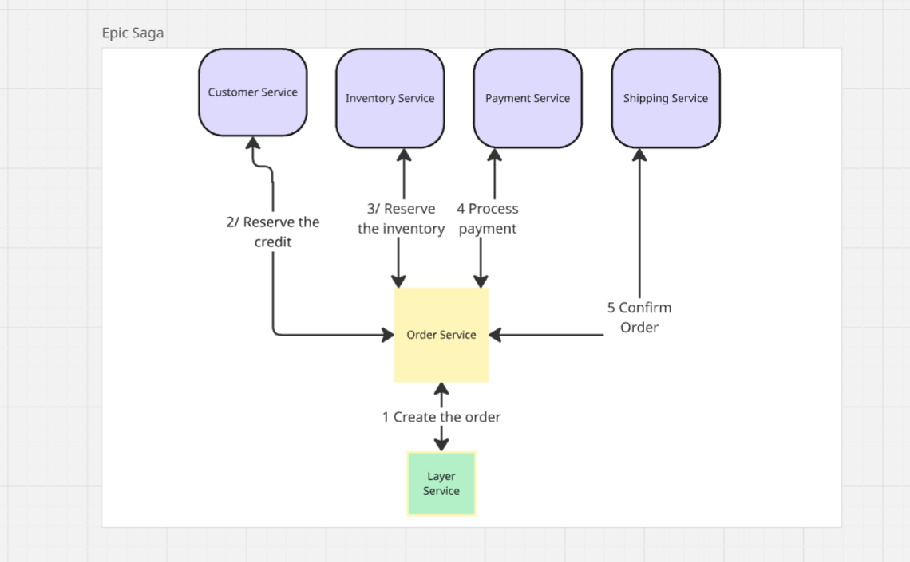

# Epic Saga (also known as an Orchestrated Saga or SAO)

## Project: Online Order Placement System

This system involves multiple services to process a customer's order. The Epic Saga pattern will ensure that either all steps are completed successfully, or the system is rolled back to a consistent state.

Services: 
- **Order Service**: The moderator service which will hold the process of the Order with the correct status. 
- **Customer Service**: Manages customer information and credit limits.  
- **Inventory Service**: Manages product stock levels. 
- **Payment Service**:  Processes payments. 
- **Shipping Service**: Arranges for the shipping of the order. 
